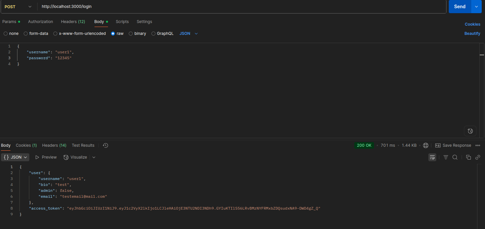

[](https://badge.fury.io/rb/jwt_rails_api_auth)


# JWT Rails-api auth

**JWTRailsAPIAuth** is a Rails generator that scaffolds a **JWT-based authentication system for rails API** with user management, password resets, refresh token rotation, and secure cookie handling. It saves you weeks of setup by providing all the models, controllers, serializers, and mailers you need for a robust, production-ready authentication flow.

## Features

- 🔑 **JWT Authentication**
    - Access tokens (short-lived, default 15 min)
    - Refresh tokens (stored securely in HttpOnly cookies)
    - Token rotation + reuse detection
    - Logout everywhere
- 👤 **User management**
    - User model with secure password
    - Role support (admin, user)
- ✉️ **Password reset**
    - Password reset tokens (sent in response until now, you can surly sent via email)
- 🛠️ **Rails Generators**
    - models (`user`,`refresh_token`)
    - controllers (`auth`, `users`, `password_resets`)
    - serializers (`user`)
    - mailers (`user`)
    - concern (`Authenticatable`)
    - initializers (`jwt_rails_api_auth`)

## Installation

Add this line to your application's Gemfile:

```bash
gem 'jwt_rails_api_auth', '~> 1.0'
```

and then run :
```bash
bundle Install
```
Or install it using :
```bash
gem install jwt_rails_api_auth
```

## Usage/Examples
Generate the full authentication system:  
```bash
rails generate auth
```

Then run:  
```bash
bundle install  
rails db:migrate  
```

### What’s Scaffolded

- **controllers/concerns**
  - `authenticatable.rb`:  
    Provides JWT-based authentication methods for controllers, including token encoding/decoding, user authorization, and admin checks.

- **controllers**
  - `auth_controller.rb`:  
    Handles login, logout, and refresh token actions.
  - `users_controller.rb`:  
    Manages user creation and allows admins to promote users.
  - `password_resets_controller.rb`:  
    Handles password reset functionality.

- **models**
  - `user.rb`
  - `refresh_token.rb`

- **initializers**
  - `jwt_rails_api_auth.rb`:  
    Template for configuring JwtRailsApiAuth (JWT secret, token expiry, role-based access).

- **serializers**
  - `user_serializer.rb`

- **mailers**
  - `user_mailer.rb`
  - `application_mailer.rb`

- **migrations**
  - `create_user.rb`
  - `create_refresh_token.rb`

- **Also insert required gems in your gemfile and add cors**
## API Routes & Request Details

- **signup**
    - header: Content-Type application/json
    - 
<!--  signup bad username taken -->
<!--  username null -->
- **login**
    - header: Content-Type application/json
    - 
<!--  login bad -->
 header
- **me (current user)**
    - 
- **expired or invalid token**
    - 
- **refresh** 
    - 
- **password resets**
    - 
    - 
- **Logout**
    - 


## 🤝 Contributing

Bug reports and pull requests are welcome on GitHub at [https://github.com/Zeyad-Hassan-1/authJWT](https://github.com/Zeyad-Hassan-1/authJWT).  

This project follows a [Code of Conduct](CODE_OF_CONDUCT.md). Please respect it in all interactions.


## Authors

- [@Zeyad Hassan](https://https://github.com/Zeyad-Hassan-1)